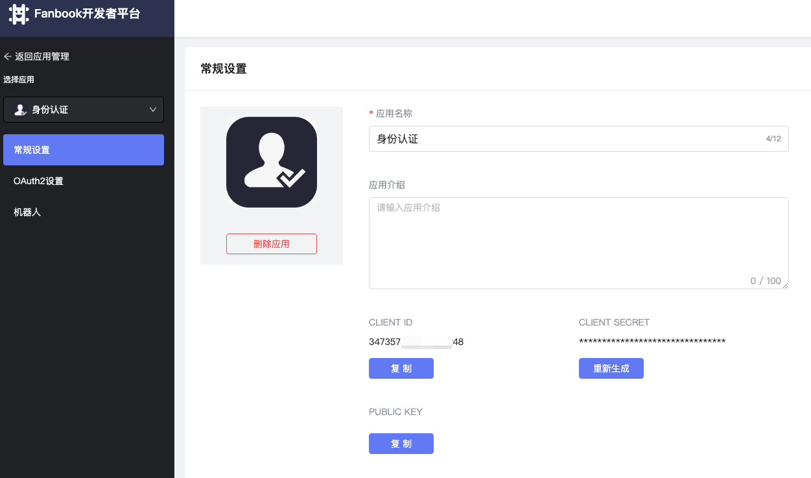
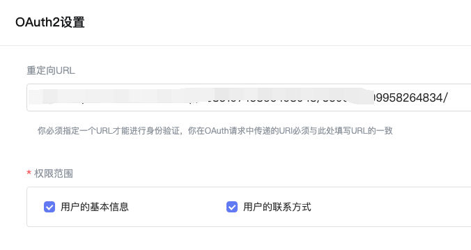

# 身份认证Bot

> Bot主要用于方便用户基于腾讯文档，完成身份的认证，实现Fanbook用户与其他平台的数据打通。

##  项目说明

本项目为采用前后端分离的方式开发，本仓库为Bot的客户端源码，源码基于React开发，相关的技术文档参考: [https://react.docschina.org/](https://react.docschina.org/)

## 使用说明

1. clone项目到本地

```git clone https://github.com/fanbook-open/fanbook-authentication-bot-client.git```

2. 执行脚本安装相关依赖；

```npm install```

3. 构建项目部署到服务器；

执行 ```npm build``` 脚本，构建项目到```dist```目录下，打包构建文档部署到服务器上；

4. 本地开发运行

本地调试开发执行脚本```npm start```

## nginx配置
 
 ```

 server {
        listen 3203;
        root /var/www/txdoc-client;

        location /fanbook/redirect {
            rewrite /* https://oauth.fanbook.mobi/authorize?response_type=code&client_id=your_client_id permanent;
        }

        location /fanbook/ {
               proxy_pass http://your_server_host:9999/fanbook/ ;
        }

    }

 ```
1. 修改配置文件中的```your_client_id```, 参数可以在[开放平台](https://open.fanbook.mobi/)获得。 




2. 修改配置文件中的```your_server_host```, 为服务端部署地址。

3. oauth授权设置




